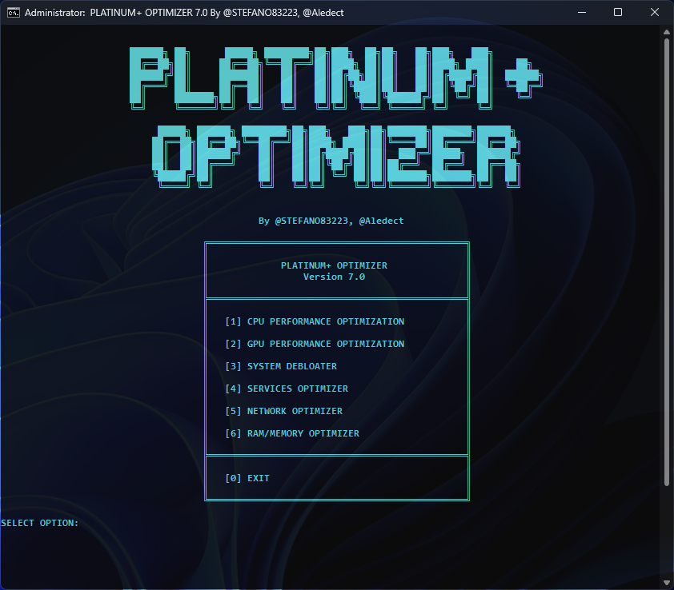

<h1 align="center">💥Platinum+ Optimizer 7.0💥</h1>


 [](./releases/latest) []()

---

## 1. 🚀 Cos'è Platinum+ Optimizer?

**Platinum+ Optimizer 7.0** è uno strumento avanzato di ottimizzazione del sistema Windows, sviluppato per massimizzare le prestazioni hardware attraverso tweak di basso livello del Kernel e del Registro di Sistema.  

Progettato per gamer, creativi e power user, il progetto mira a eliminare i colli di bottiglia del sistema operativo, riducendo drasticamente la latenza di input e stabilizzando il framerate attraverso un'interfaccia testuale intuitiva e potente.

---

## 2. 🛠️ Architettura dei Moduli di Ottimizzazione

Il Platinum+ Optimizer è diviso in **6 sezioni specializzate**, ognuna progettata per intervenire su un'area critica del sistema operativo:

### ⚡ [1] CPU Performance Optimization
Ottimizza la gestione dei cicli di clock e del carico di lavoro, disabilitando il **Core Parking** e regolando l'**Interrupt Moderation**, per massima reattività in applicazioni e giochi ad alto carico.

### 🎮 [2] GPU Performance Optimization
Migliora la pipeline grafica, configurando driver NVIDIA, AMD e Intel, gestendo la cache degli shader e ottimizzando la modalità di alimentazione per ridurre micro-stutter e garantire framerate stabile.

### 🚫 [3] System Debloater
Rimuove telemetria, tracciamento dati e app preinstallate (UWP) non necessarie, liberando risorse di CPU, RAM e spazio disco per un sistema più snello e privato.

### ⚙️ [4] Services Optimizer
Disabilita i servizi Windows non essenziali, riducendo l'overhead del kernel e migliorando tempi di avvio e reattività generale del desktop.

### 🌐 [5] Network Optimizer
Ottimizza lo stack TCP/IP per ridurre la latenza di rete, migliorando stabilità e velocità di connessione per gaming competitivo e streaming.

### 🧠 [6] RAM/Memory Optimizer
Gestisce in modo intelligente il **Pagefile**, pulisce la **Standby List** e previene il paging eccessivo, garantendo che le applicazioni critiche abbiano accesso alla memoria più veloce.

---
## 3. 📋 Requisiti di Sistema

Per sfruttare al massimo i tweak del kernel, si consiglia **l’uso di una versione pulita di Windows** (preferibilmente **Windows X Lite**) con le seguenti release:

| Sistema Operativo | Versione consigliata | Sito Web |
| :--- | :--- | :--- |
| Windows 10 | Optium 10 (ultima versione) | [Visita sito](https://windowsxlite.com/win10/) |
| Windows 11 | Optium 11 (ultima versione) | [Visita sito](https://windowsxlite.com/win11/) |


‎ 
| Componente | Requisito Minimo | Consigliato |
| :--- | :--- | :--- |
| **Architettura** | x64 | x64 |
| **RAM** | 4 GB | 16 GB+ |

**Diritti autore / crediti:**  
Creatore ISO: [FBConan](https://ko-fi.com/windowsxlite)  

---

## 4. 📥 Come installarlo

Il software può essere scaricato **direttamente dal sito ufficiale**: [Platinum+ Optimizer Download](https://github.com/STEFANO83223/platinum-optimizer/releases/latest)  

Il software è distribuito come script batch. Segui questi passaggi:

1. **Download**  
   Scarica l'ultima release ufficiale dal link sopra.

2. **Antivirus (temporaneo)**  
   ⚠️ Disattiva temporaneamente **il tuo antivirus** prima dell’esecuzione.

3. **Esecuzione**  
   Fai clic destro sul file `Platinum+Optimizer.bat` e seleziona **"Esegui come Amministratore"**.

```bash
⚠️ Nota importante

L’antivirus deve essere disattivato temporaneamente perché lo script esegue
ottimizzazioni di sistema e modifiche a componenti sensibili (kernel e servizi di Windows).
Queste operazioni vengono spesso bloccate o rilevate come falsi positivi dagli antivirus.
```


### 📸 Screenshot dell'interfaccia


---

## 5. 👥 Crediti

- [**Assistenza e bug**](https://t.me/c/2611775805/1)
- [**@STEFANO83223**](https://t.me/STEFANO83223) - Developer & Tester (Fixes, Bugs)  
- [**@Aledect**](https://t.me/aledect) - Tester, Bug Fixes & Designer (UI/UX)  
- [**@Gattuccio90**](https://t.me/Gattucio90) - Website Development


---

## 6. 📜 Licenza

Copyright © 2025 Platinum+ Optimizer.  
**LICENZA PROPRIETARIA.**

* ❌ Vietata la ridistribuzione non autorizzata.  
* ❌ Vietata la decompilazione o modifica del codice sorgente.  
* ⚠️ Gli autori **non sono responsabili** per un uso non corretto del tweak. 
